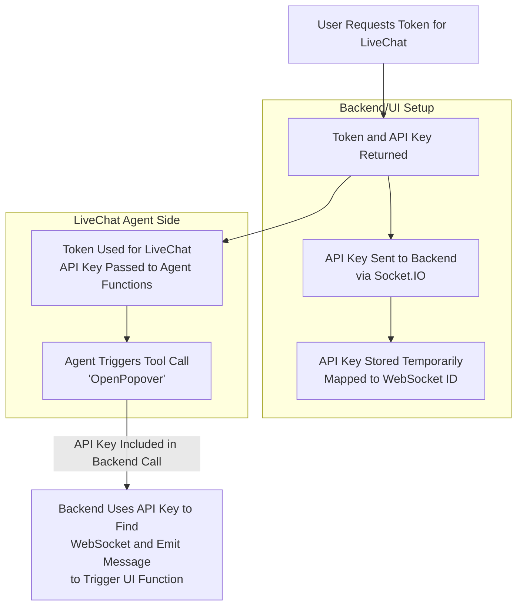

# Voice Agent Tools Flow Documentation

## Overview

This document describes how voice agent tools interact with the user interface in DiagramMagic. The architecture ensures that AI agents cannot directly modify the database or application state. Instead, tools trigger JavaScript functions in the frontend, providing visible feedback and maintaining security.

## Architecture Principles

1. **No Direct Database Access**: Agent tools never directly write to the database
2. **UI-First Actions**: All agent actions trigger UI functions that the user can see
3. **Secure Identification**: API keys map agent sessions to specific WebSocket connections
4. **Traceable Flow**: Every action can be traced from agent → backend → UI

## Flow Diagram



## Step-by-Step Flow

### 1. Token Request
**File**: `voice-agent/src/server.ts`

When the user opens the voice agent modal:
- Frontend requests a token from `http://localhost:3002/token`
- Server generates:
  - LiveKit JWT token (for voice connection)
  - Unique API key (for tool calls)

```typescript
const voiceApiKey = generateApiKey(); // Format: va_[64-char-hex]

const token = new AccessToken(apiKey, apiSecret, {
  identity: participantName,
  metadata: JSON.stringify({ apiKey: voiceApiKey }),
});
```

**Response**:
```json
{
  "token": "eyJhbGc...",
  "url": "wss://...",
  "roomName": "diagram-magic-...",
  "apiKey": "va_abc123..."
}
```

### 2. Parallel Setup

#### 2a. Backend Socket.IO Registration
**File**: `frontend/src/components/VoiceAgentModal.tsx`

The frontend registers the API key with the backend:

```typescript
useEffect(() => {
  if (apiKey && socket) {
    socket.emit('voice-agent:register', apiKey);
  }
}, [apiKey, socket]);
```

**File**: `backend/src/index.ts`

Backend stores the mapping:

```typescript
const voiceAgentApiKeyMap = new Map<string, string>(); // apiKey -> socketId

socket.on('voice-agent:register', (apiKey: string) => {
  voiceAgentApiKeyMap.set(apiKey, socket.id);
});
```

#### 2b. LiveKit Connection
The frontend uses the token to connect to LiveKit and start the voice session. The API key is embedded in the token metadata and accessible to the agent.

### 3. Agent Tool Execution
**File**: `voice-agent/src/index.ts`

When the agent wants to trigger a UI action:

1. **Agent extracts API key from metadata**:
```typescript
const participant = ctx.room.localParticipant;
const metadata = JSON.parse(participant.metadata);
const apiKey = metadata.apiKey;
```

2. **Tool is called by AI**:
```typescript
const openPopoverTool = createOpenPopoverTool(apiKey);
```

3. **Tool calls backend**:
```typescript
async function callBackendTool(apiKey, toolName, params) {
  await fetch('http://localhost:3001/api/voice-agent/tool-call', {
    method: 'POST',
    body: JSON.stringify({ apiKey, toolName, params }),
  });
}
```

### 4. Backend Routes to UI
**File**: `backend/src/index.ts`

Backend receives the tool call:

```typescript
app.post('/api/voice-agent/tool-call', (req, res) => {
  const { apiKey, toolName, params } = req.body;

  // Look up WebSocket by API key
  const socketId = voiceAgentApiKeyMap.get(apiKey);
  const socket = io.sockets.sockets.get(socketId);

  // Emit event to specific client
  socket.emit(`voice-agent:${toolName}`, params);
});
```

### 5. UI Handles Event
**File**: `frontend/src/components/VoiceAgentModal.tsx`

Frontend listens for the event and triggers UI action:

```typescript
socket.on('voice-agent:OpenPopover', (params) => {
  setPopoverOpen(true);
  setTimeout(() => setPopoverOpen(false), 5000);
});
```

## Security Considerations

### API Key Generation
- 64-character hexadecimal string
- Prefixed with `va_` for identification
- Cryptographically random (`crypto.randomBytes(32)`)

### API Key Lifecycle
1. **Created**: When token is requested
2. **Registered**: When Socket.IO connection is established
3. **Used**: During agent tool calls
4. **Destroyed**: When Socket.IO disconnects

```typescript
socket.on('disconnect', () => {
  // Clean up API key mapping
  for (const [apiKey, socketId] of voiceAgentApiKeyMap.entries()) {
    if (socketId === socket.id) {
      voiceAgentApiKeyMap.delete(apiKey);
    }
  }
});
```

### Validation
- API key required for all tool calls
- Socket ID must exist and be connected
- Stale mappings are automatically cleaned

## Adding New Tools

### 1. Create Tool Function
**File**: `voice-agent/src/index.ts`

```typescript
function createMyCustomTool(apiKey: string): llm.FunctionToolImplementation {
  return {
    description: 'Description of what the tool does',
    parameters: {
      type: 'object',
      properties: {
        param1: {
          type: 'string',
          description: 'Parameter description',
        },
      },
      required: ['param1'],
    },
    execute: async ({ param1 }: { param1: string }) => {
      await callBackendTool(apiKey, 'MyCustomTool', { param1 });
      return JSON.stringify({ success: true });
    },
  };
}
```

### 2. Register Tool with Agent
```typescript
const agent = new voice.Agent({
  // ... other config
  fnc_ctx: {
    calculator: calculatorTool,
    OpenPopover: createOpenPopoverTool(apiKey),
    MyCustomTool: createMyCustomTool(apiKey), // Add here
  },
});
```

### 3. Add UI Handler
**File**: `frontend/src/components/VoiceAgentModal.tsx` (or relevant component)

```typescript
socket.on('voice-agent:MyCustomTool', (params) => {
  // Handle the UI action
  console.log('Custom tool triggered:', params);
  // Update UI state, show modal, etc.
});
```

## Example: OpenPopover Tool

This is the reference implementation for testing the flow.

### Agent Side
```typescript
const openPopoverTool = {
  description: 'Open a popover notification in the UI',
  execute: async ({ message }: { message?: string }) => {
    await callBackendTool(apiKey, 'OpenPopover', { message });
    return JSON.stringify({ success: true });
  },
};
```

### UI Side
```typescript
const [popoverOpen, setPopoverOpen] = useState(false);

socket.on('voice-agent:OpenPopover', (params) => {
  setPopoverOpen(true);
  setTimeout(() => setPopoverOpen(false), 5000);
});
```

### Usage
User says: *"Open a popover"*

Flow:
1. ✅ Agent recognizes intent
2. ✅ Calls OpenPopover tool
3. ✅ Tool calls backend with API key
4. ✅ Backend emits to UI via WebSocket
5. ✅ UI shows popover notification
6. ✅ User sees visible feedback

## File Reference

| File | Purpose |
|------|---------|
| `voice-agent/src/server.ts` | Generates tokens and API keys |
| `voice-agent/src/index.ts` | Agent worker, tool definitions |
| `backend/src/index.ts` | API key mapping, tool call endpoint |
| `frontend/src/components/VoiceAgentModal.tsx` | API key registration, UI handlers |

## Environment Variables

```bash
# Voice Agent (backend/.env)
VOICE_AGENT_PORT=3002
VOICE_AGENT_MODEL=llama-3.3-70b

# LiveKit
LIVEKIT_API_KEY=your_key
LIVEKIT_API_SECRET=your_secret
LIVEKIT_URL=wss://your-project.livekit.cloud

# AI Services
CEREBRAS_API_KEY=your_cerebras_key
DEEPGRAM_API_KEY=your_deepgram_key
CARTESIA_API_KEY=your_cartesia_key
```

## Testing

1. Start all services: `./manage.sh start`
2. Click the headset button in the UI
   - **Keyboard shortcut**: Press **Ctrl+K** (Windows/Linux) or **Cmd+K** (Mac) to start the voice assistant
3. Say: *"Open a popover"*
4. Verify: Green bouncing popover appears
5. Check logs:
   - Backend: API key registration
   - Voice agent worker: Tool execution
   - Backend: Tool call received
   - Frontend console: Event received

## Future Tool Ideas

- **CreateDiagram**: Generate diagram from voice description
- **OpenProject**: Switch to a different project
- **SaveDiagram**: Save current diagram with voice-specified name
- **ShareDiagram**: Generate shareable link
- **ExportDiagram**: Export to PNG/SVG
- **UndoAction**: Undo last change
- **ShowHelp**: Display help modal

All follow the same pattern: Agent → Backend → UI
